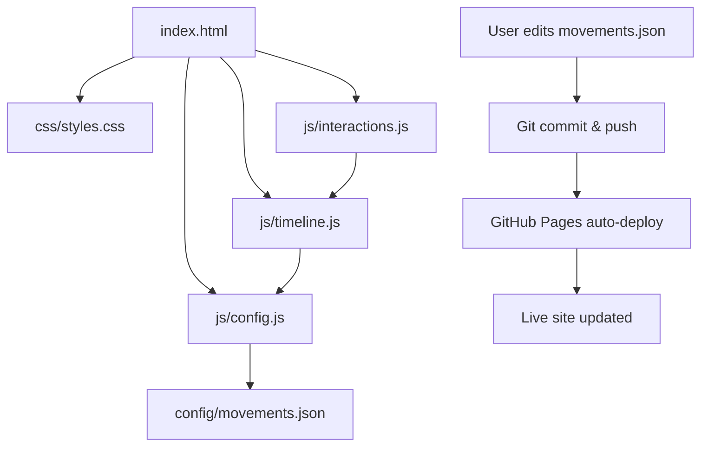
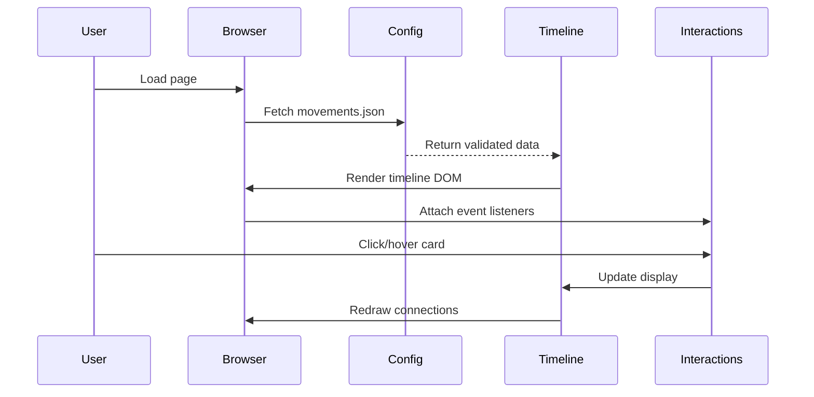

# Technical Strategy: SF Timeline Refactoring & Deployment

**Feature:** Refactor science-fiction timeline visualization for clean deployment
**Stack:** Vanilla JavaScript, JSON config, CSS3, GitHub Pages
**Related Links:** N/A

## Technical Gaps

**What's missing in our current system?**
- Gap 1: All code (HTML, CSS, JS, data) bundled in a single 1,400-line file
- Gap 2: No separation between configuration data and application logic
- Gap 3: No deployment configuration or hosting setup
- Gap 4: No data validation or schema enforcement
- Gap 5: No developer documentation for maintenance

## Solution Overview

**How we'll build it:**
We'll refactor the monolithic HTML file into a modular structure with separated concerns: configuration data in JSON, styling in CSS, logic in JavaScript modules, and minimal HTML. This enables easy configuration updates, maintainability, and deployment to GitHub Pages.

**Key decisions:**
1. **Keep it build-free:** Use vanilla JavaScript ES6 modules for zero build complexity and maximum hosting compatibility
2. **JSON for configuration:** Pure JSON format for data allows easy editing, validation, and potential future tooling
3. **GitHub Pages deployment:** Free, git-based workflow, automatic HTTPS, custom domain support

## Technical Diagrams





## Testing Strategy

```javascript
// js/validation.js - Schema validation
function validateMovementData(data) {
  const errors = [];

  // Required fields check
  if (!Array.isArray(data)) {
    errors.push('Data must be an array');
    return errors;
  }

  data.forEach((movement, idx) => {
    if (!movement.id) errors.push(`Movement ${idx}: missing id`);
    if (!movement.title) errors.push(`Movement ${idx}: missing title`);
    // ... more validation
  });

  return errors;
}

// Manual testing checklist
// - [ ] Timeline renders correctly on desktop
// - [ ] Timeline renders correctly on mobile
// - [ ] All connections draw properly
// - [ ] Clicking cards expands details
// - [ ] Hovering highlights connections
// - [ ] Clicking connection links scrolls to target
// - [ ] JSON validation catches malformed data
```

## Implementation Overview

### Implementation Files

```
sf_history/
├── index.html                    (CREATE) - Minimal HTML shell
├── css/
│   └── styles.css               (CREATE) - All styling extracted
├── js/
│   ├── config.js                (CREATE) - Config loader & validator
│   ├── timeline.js              (CREATE) - Core rendering logic
│   ├── interactions.js          (CREATE) - Event handlers
│   └── validation.js            (CREATE) - Schema validation
├── config/
│   └── movements.json           (CREATE) - All timeline data
├── docs/
│   └── STRATEGY_01_refactor_timeline_app.md (THIS FILE)
├── .github/
│   └── workflows/
│       └── deploy.yml           (CREATE) - Optional CI/CD
├── README.md                    (CREATE) - Documentation
└── fresque_sf_finale.html       (KEEP) - Original backup
```

### Domain Foundation

**Data Model (TypeScript notation for clarity):**

```typescript
// This is documentation only - we're using vanilla JS
interface Movement {
  id: string;                    // Unique identifier (kebab-case)
  title: string;                 // Display name
  period: string;                // Date range (e.g., "1920-1960")
  year: number;                  // Center year for positioning
  description: string;           // Brief summary
  context: {
    historical: string;          // Historical background
    philosophical: string;       // Key philosophical questions
    literary: string;            // Literary innovations
    scientific: string;          // Scientific concepts
    themes: string;              // Recurring themes
  };
  authors: Array<{
    name: string;                // Full name
    gender: "M" | "F";          // For statistics & highlighting
    favorite?: boolean;          // Optional star marking
  }>;
  works: string[];               // Major works with format: "Title (Author, Year)"
  connections: {
    influence?: Array<{to: string, desc: string}>;  // Direct influence
    reaction?: Array<{to: string, desc: string}>;   // Counter-reaction
    evolution?: Array<{to: string, desc: string}>;  // Evolution from
    related?: Array<{to: string, desc: string}>;    // Related to
  };
}

interface TimelineConfig {
  movements: Movement[];
  metadata?: {
    title?: string;
    subtitle?: string;
    version?: string;
  };
}
```

**JSON Schema Example:**

```json
{
  "movements": [
    {
      "id": "proto-sf",
      "title": "Proto-SF / Romans Scientifiques",
      "period": "1818-1920",
      "year": 1870,
      "description": "Les précurseurs de la SF moderne...",
      "context": {
        "historical": "Révolution industrielle...",
        "philosophical": "Jusqu'où l'humain peut-il...",
        "literary": "Naissance du roman d'aventure...",
        "scientific": "Galvanisme et électricité...",
        "themes": "La hubris scientifique..."
      },
      "authors": [
        { "name": "Mary Shelley", "gender": "F" },
        { "name": "Jules Verne", "gender": "M" }
      ],
      "works": [
        "Frankenstein (Shelley, 1818)",
        "Vingt mille lieues sous les mers (Verne, 1870)"
      ],
      "connections": {
        "influence": [
          { "to": "pulp-sf", "desc": "Influence fondatrice sur tout le genre" }
        ]
      }
    }
  ]
}
```

### Interfaces

**Module Structure:**

**1. config.js - Configuration Loader**
```javascript
// Loads and validates configuration data
export async function loadConfig() {
  const response = await fetch('./config/movements.json');
  const data = await response.json();

  const errors = validateMovementData(data.movements);
  if (errors.length > 0) {
    console.error('Configuration errors:', errors);
    throw new Error('Invalid configuration data');
  }

  return data;
}

export function getMovements() {
  return window._timelineData?.movements || [];
}
```

**2. timeline.js - Core Rendering**
```javascript
// Main rendering engine
export function renderTimeline(movements) {
  const timeline = document.getElementById('timeline');

  // Add SVG canvas
  addConnectionSVG(timeline);

  // Render each movement
  movements.forEach((movement, index) => {
    const card = createMovementCard(movement, index);
    timeline.appendChild(card);
  });

  // Draw connections after DOM ready
  setTimeout(drawConnections, 100);
}

export function drawConnections() {
  // SVG path drawing logic
}

function createMovementCard(movement, index) {
  // Card creation logic
}
```

**3. interactions.js - Event Handlers**
```javascript
// User interaction handling
export function setupInteractions() {
  document.addEventListener('click', handleCardClick);
  document.addEventListener('mouseover', handleCardHover);
  window.addEventListener('resize', handleResize);
}

function handleCardClick(event) {
  const card = event.target.closest('.movement-card');
  if (card) toggleDetails(card);
}

export function scrollToMovement(id) {
  // Smooth scroll to specific movement
}
```

**4. validation.js - Data Validation**
```javascript
export function validateMovementData(movements) {
  const errors = [];
  const ids = new Set();

  // Validation logic
  movements.forEach((movement, idx) => {
    // Check required fields
    if (!movement.id) errors.push(`Movement ${idx}: missing id`);

    // Check for duplicate IDs
    if (ids.has(movement.id)) {
      errors.push(`Duplicate ID: ${movement.id}`);
    }
    ids.add(movement.id);

    // Validate connection references
    movement.connections?.influence?.forEach(conn => {
      // Will validate after all movements loaded
    });
  });

  return errors;
}
```

### Infrastructure

**GitHub Pages Setup:**

```yaml
# .github/workflows/deploy.yml (Optional - manual push also works)
name: Deploy to GitHub Pages

on:
  push:
    branches: [ main ]
  workflow_dispatch:

permissions:
  contents: read
  pages: write
  id-token: write

jobs:
  deploy:
    environment:
      name: github-pages
      url: ${{ steps.deployment.outputs.page_url }}
    runs-on: ubuntu-latest
    steps:
      - name: Checkout
        uses: actions/checkout@v4
      - name: Setup Pages
        uses: actions/configure-pages@v4
      - name: Upload artifact
        uses: actions/upload-pages-artifact@v3
        with:
          path: '.'
      - name: Deploy to GitHub Pages
        id: deployment
        uses: actions/deploy-pages@v4
```

**Deployment Steps:**

1. Create GitHub repository
2. Push code
3. Enable GitHub Pages in Settings → Pages → Source: main branch
4. Access at: `https://username.github.io/sf_history/`

### Standards & Patterns

**JavaScript:**

- Use ES6 modules (`export`/`import`)
- Use `const` and `let`, avoid `var`
- Use template literals for HTML generation
- Use arrow functions for callbacks
- Document public functions with JSDoc comments

**CSS:**

- Keep existing BEM-like naming conventions
- Maintain mobile-first responsive approach
- Keep CSS custom properties for theming
- Preserve animation and transition styles

**JSON:**

- Use 2-space indentation
- Keep consistent ordering: id, title, period, year, description, context, authors, works, connections
- Validate before committing

**File Organization:**

- One module per file
- Keep files under 300 lines
- Group related functions together
- Export public API explicitly

## Migration Path

**Phase 1: Extract & Separate (Non-breaking)**

1. Create directory structure
2. Extract movements data to `movements.json`
3. Extract CSS to `styles.css`
4. Create JavaScript modules
5. Create new `index.html`
6. Keep original `fresque_sf_finale.html` as backup

**Phase 2: Validation & Testing**

1. Add validation.js
2. Test all interactions manually
3. Test on different browsers
4. Test on mobile devices
5. Validate JSON schema

**Phase 3: Deployment**

1. Create GitHub repository
2. Push refactored code
3. Enable GitHub Pages
4. Test live deployment
5. Document configuration process

**Phase 4: Cleanup**

1. Archive original file
2. Update README
3. Create contribution guide
4. Add example movement entry

## Future Enhancements

**Out of scope for this strategy:**

- Admin UI for editing movements (could use a simple form generator)
- Search/filter functionality beyond existing filter buttons
- Export/import functionality (CSV, other formats)
- Multiple timeline support (different topics)
- Internationalization (multiple languages)
- Dark/light theme toggle
- Print-friendly stylesheet
- Accessibility improvements (ARIA labels, keyboard navigation)

## Success Criteria

- [x] All code separated into logical modules
- [ ] Configuration in clean JSON format
- [ ] Data validation prevents errors
- [ ] Application works identically to original
- [ ] Successfully deployed to GitHub Pages
- [ ] README documents how to add/edit movements
- [ ] Mobile responsive behavior preserved
- [ ] All interactions (expand, scroll, highlight) working
- [ ] SVG connections render correctly
- [ ] Cross-browser compatible (Chrome, Firefox, Safari)

## Configuration Guide

**Adding a New Movement:**

```json
{
  "id": "new-movement-id",
  "title": "New Movement Name",
  "period": "2020-2030",
  "year": 2025,
  "description": "Brief description of the movement",
  "context": {
    "historical": "What was happening in the world?",
    "philosophical": "What questions did it explore?",
    "literary": "What were its narrative innovations?",
    "scientific": "What scientific concepts did it use?",
    "themes": "What were its recurring themes?"
  },
  "authors": [
    { "name": "Author Name", "gender": "F", "favorite": true }
  ],
  "works": [
    "Work Title (Author, Year)"
  ],
  "connections": {
    "influence": [
      { "to": "other-movement-id", "desc": "How it influenced" }
    ]
  }
}
```

**Connection Types:**

- `influence`: Direct influence on another movement
- `reaction`: Counter-reaction or rejection of another movement
- `evolution`: Natural evolution from another movement
- `related`: Parallel or complementary movement
